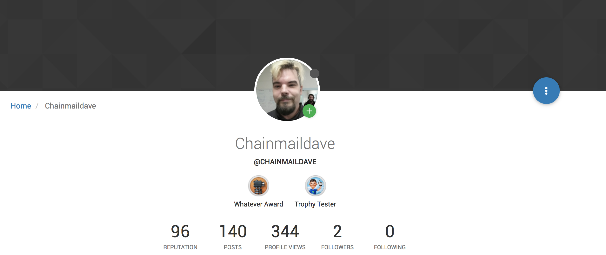
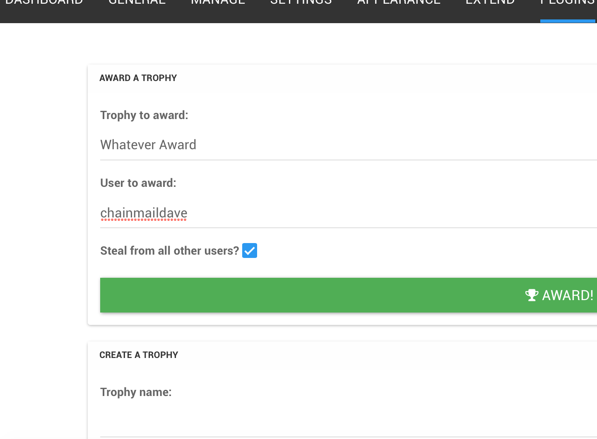

Trophy Plugin for NodeBB
================

This plugin lets you create reward badges for your users and manually add them to their user profile.

It was developed for use on [Kamloops Makerspace website](http://kamloopsmakerspace.com/).

Here's some picture to give you an idea what it is:

And here's how it looks like on the admin side:

Setup
---
First, install it to your NodeBB instance. You can do it from the admin interface (once the plugin gets approved to be listed on the catalogue) or you can install it with

     npm install nodebb-plugin-trophies

from your nodebb install directory.

Plugin uses widget system, but intended to be displayed only on the user profile page. Therefore, you have to have a widget area in your theme, template file templates/account/profile.tpl to be more specific, in order display this widget.

For the Persona theme, I had to add following, around line 12:

     

Then, you can go to your admin panel and go hog wild.

It even sends a notification to the user who just got an award. Neat, eh?

Modify
------

Please fork and do stuff.

License
------

I'd love to switch to more liberal license, but since this thing is based off someone else's code, I have a file called LICENSE, go read.

Credits
------

- This is my first plugin for NodeBB and I started off [psychobunny's badges plugin](https://github.com/psychobunny/nodebb-plugin-badges). I'd say it is loosely based on it. Thanks, psychobunny!

- Default badge art generously contributed by Pablo Macuso
